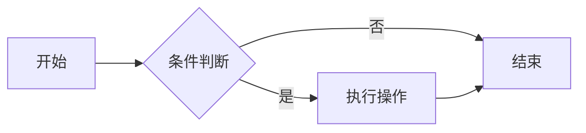
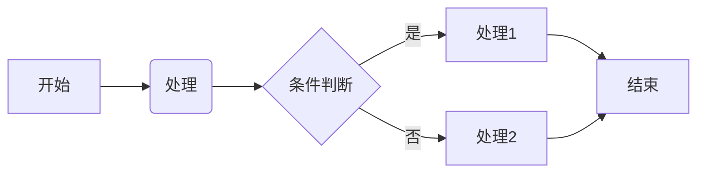
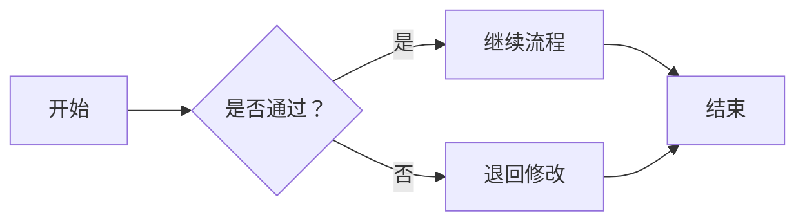
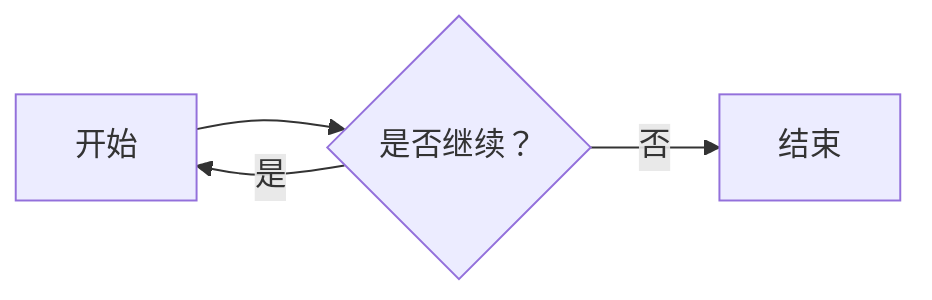
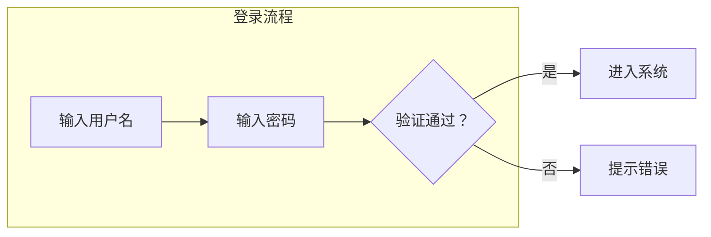
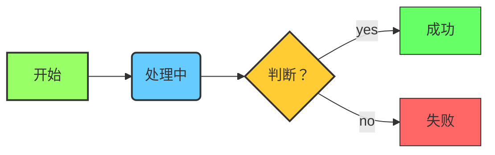

```mermaid
graph LR
A[开始] --> B{条件判断}
B -- 是 --> C[执行操作]
B -- 否 --> D[结束]
C --> D
```

---

```mermaid
graph LR
A[开始] --> B(处理)
B --> C{条件判断}
C -- 是 --> D[处理1]
C -- 否 --> E[处理2]
D --> F[结束]
E --> F
```

```mermaid
graph LR
Start[开始] --> Check{是否通过？}
Check -- 是 --> Pass[继续流程]
Check -- 否 --> Reject[退回修改]
Pass --> End[结束]
Reject --> End
```

```mermaid
graph LR
A[开始] --> B{是否继续？}
B -- 是 --> A
B -- 否 --> C[结束]
```

```mermaid
graph LR
subgraph 登录流程
    A[输入用户名] --> B[输入密码]
    B --> C{验证通过？}
end
C -- 是 --> D[进入系统]
C -- 否 --> E[提示错误]
```

```mermaid
graph LR
A[开始]:::start --> B(处理中):::process --> C{判断？}:::decision
C -->|yes| D[成功]:::success
C -->|no| E[失败]:::fail

classDef start fill:#9f6,stroke:#333,stroke-width:2px;
classDef process fill:#6cf,stroke:#333,stroke-width:2px;
classDef decision fill:#fc3,stroke:#333,stroke-width:2px;
classDef success fill:#6f6,stroke:#333;
classDef fail fill:#f66,stroke:#333;
```
